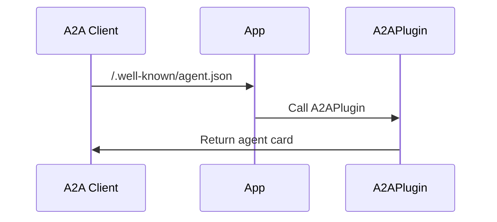
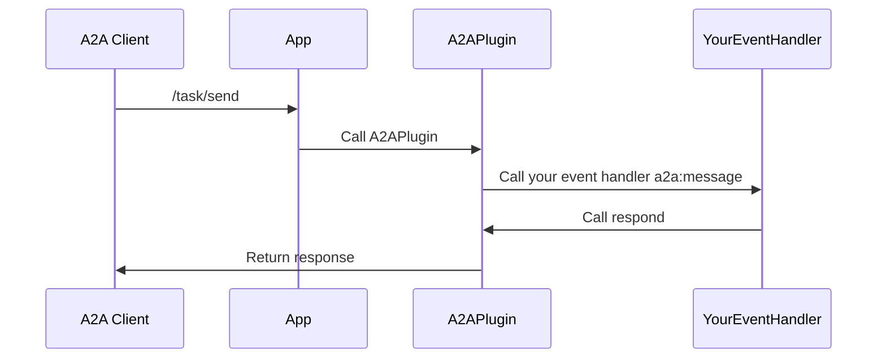

# Teams: a2a

<p>
    <a href="https://www.npmjs.com/package/@microsoft/teams.a2a" target="_blank">
        
    </a>
    <a href="https://www.npmjs.com/package/@microsoft/teams.a2a?activeTab=code" target="_blank">
        
    </a>
    <a href="https://www.npmjs.com/package/@microsoft/teams.a2a?activeTab=dependencies" target="_blank">
        
    </a>
    <a href="https://www.npmjs.com/package/@microsoft/teams.a2a" target="_blank">
        
    </a>
    <a href="https://microsoft.github.io/teams.ts" target="_blank">
        
    </a>
</p>

This is a plugin that enables your Teams agent to be used as an A2A agent.

-   [What is A2A?](https://google.github.io/A2A)

Teams AI Library allows your applications to easily be accessible via Teams. However, using this plugin, you can also enable your agent to be used as an A2A agent so that it can be used by other A2A clients.

## Configuration

Configuring the App to use the A2APlugin simply requires the `AgentCard`.

```ts
import { schema } from "@microsoft/teams.a2a";

declare const myAgentCard: AgentCard;

const app = new App({
    plugins: [
        new A2APlugin({
            agentCard: myAgentCard,
        }),
    ],
});
```

With this simple configuration, the A2APlugin will listen for A2A requests on the `/a2a` path and return the agent card when requested.

## Agent Card

The plugin automatically exposes the agent card at the path `/.well-known/agent.json`.



## A2A Requests



Handling A2A requests is similar to handling app-requests. Simply add an event handler for the `a2a:message` event. You may `accumulateArtifacts` to iteratively accumulate artifacts for the task, or simply `respond` with the final result.

> [!NOTE]
> You must have only a single handler that calls `respond`. And you **must** call `respond` as the last step in your handler. This is because the `respond` function resolves the open request to the caller.

```ts
app.event(
    "a2a:message",
    async ({ taskContext, respond, accumulateArtifacts }) => {
        // The taskContext contains details about the task request
        const result = await myEventHandler(taskContext, accumulateArtifacts);
        await respond(result);
    }
);
```
