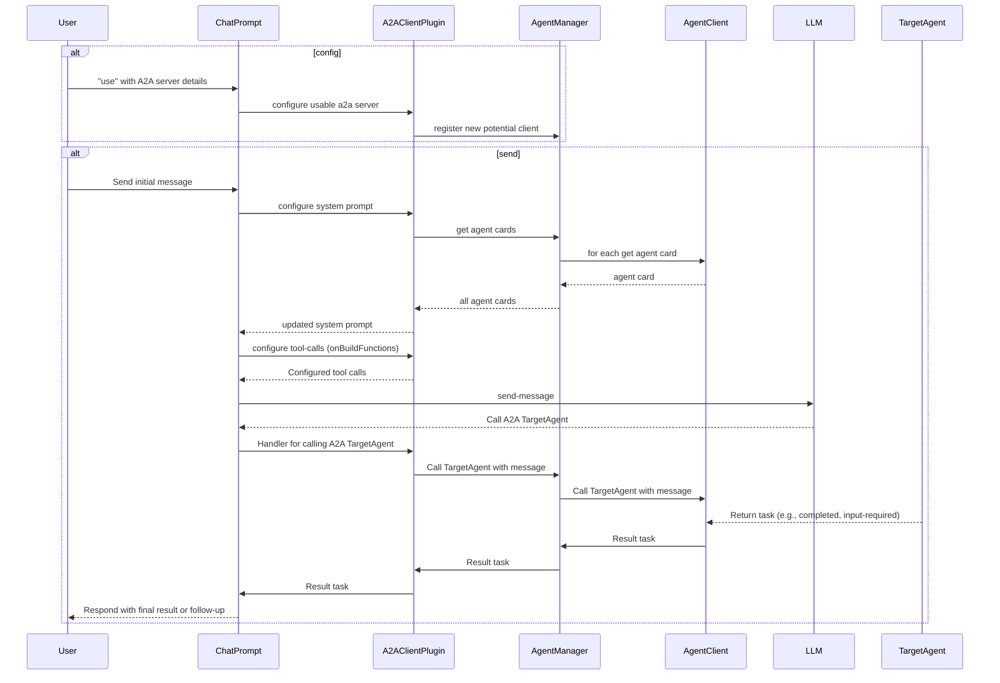

# Teams: a2a

<p>
    <a href="https://www.npmjs.com/package/@microsoft/teams.a2a" target="_blank">
        
    </a>
    <a href="https://www.npmjs.com/package/@microsoft/teams.a2a?activeTab=code" target="_blank">
        
    </a>
    <a href="https://www.npmjs.com/package/@microsoft/teams.a2a?activeTab=dependencies" target="_blank">
        
    </a>
    <a href="https://www.npmjs.com/package/@microsoft/teams.a2a" target="_blank">
        
    </a>
    <a href="https://microsoft.github.io/teams.ts" target="_blank">
        
    </a>
</p>

This is a plugin that enables your Teams agent to be used as an A2A agent.

> [!NOTE]
> The A2A protocol is still early in development and hence this package is fairly experimental.

-   [What is A2A?](https://google.github.io/A2A)

## Server

Teams AI Library allows your applications to easily be accessible via Teams. However, using this plugin, you can also enable your agent to be used as an A2A agent so that it can be used by other A2A clients.

### Configuration

Configuring the App to use the A2APlugin simply requires the `AgentCard`.

```ts
import { schema, A2APlugin } from "@microsoft/teams.a2a";
import { App } from "@microsoft/teams.apps";

declare const myAgentCard: AgentCard;

const app = new App({
    plugins: [
        new A2APlugin({
            agentCard: myAgentCard,
        }),
    ],
});
```

With this simple configuration, the A2APlugin will listen for A2A requests on the `/a2a` path and return the agent card when requested.

### Agent Card

The plugin automatically exposes the agent card at the path `/.well-known/agent.json`.


### A2A Requests


Handling A2A requests is similar to handling app-requests. Simply add an event handler for the `a2a:message` event. You may `accumulateArtifacts` to iteratively accumulate artifacts for the task, or simply `respond` with the final result.

> [!NOTE]
> You must have only a single handler that calls `respond`. And you **must** call `respond` as the last step in your handler. This is because the `respond` function resolves the open request to the caller.

```ts
app.event(
    "a2a:message",
    async ({ taskContext, respond, accumulateArtifacts }) => {
        // The taskContext contains details about the task request
        const result = await myEventHandler(taskContext, accumulateArtifacts);
        await respond(result);
    }
);
```

## Client

The A2A client is able to call different A2A servers. You are able to use the `AgentManager` to call different A2A Servers.

```ts
import { AgentManager } from "@microsoft/teams.a2a";

const agentManager = new AgentManager();

agentManager.use("my-agent", "https://my-agent.com/a2a");
await agentManager.sendTask("my-agent", {
    id: continueTaskId || generateRequestId().toString(),
    message: {
      role: 'user',
      parts: [{ type: 'text' as const, text: message }],
    },
    {},
});
```

If you are using the `A2APlugin` described above, you can use the `clientManger` property in that plugin object to get an instance of the `AgentManager` and use it to send tasks proactively to different A2A servers.

### Chat Prompt

A2A is most effective when used with an LLM. The `A2AClientPlugin` can be used to add a plugin to your chat prompt that will allow you to automatically include A2A agents as a possible source of interaction. The interaction can be outlined as below:



Usage:

```ts
import { A2APlugin } from "@microsoft/teams.a2a";
import { ChatPrompt } from "@microsoft/teams.ai";

const plugin = new A2APlugin();

const chatPrompt = new ChatPrompt({
    plugins: [plugin],
}).usePlugin("a2a", {
    key: "my-agent",
    url: "https://my-agent.com/a2a",
});

const result = await chatPrompt.sendMessage("Hello, world!");

console.log(result);
```
